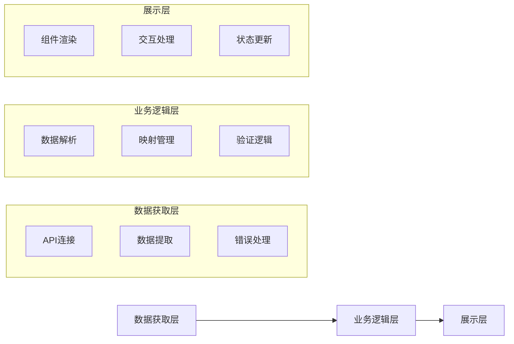
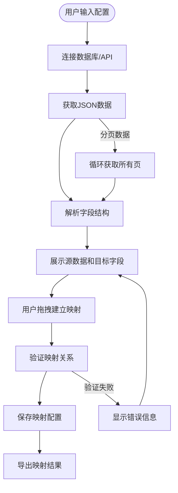
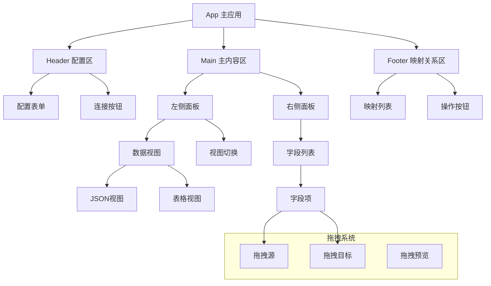
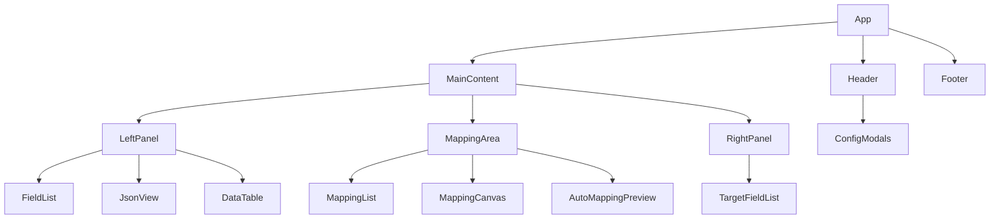
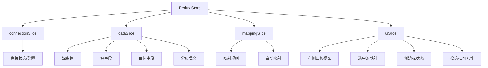
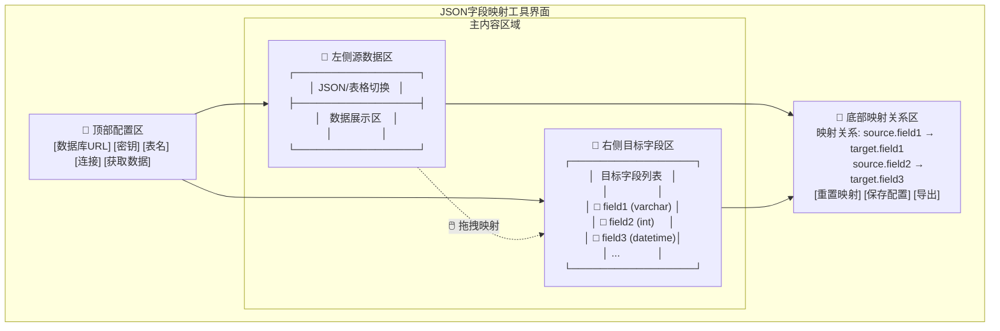
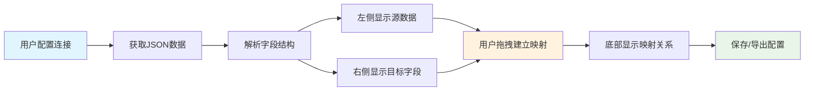
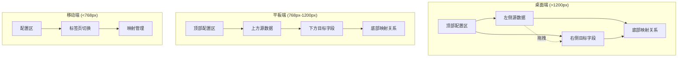

# JSON 字段映射工具开发文档

## 1. 项目概述

### 1.1 项目背景

当用户请求远程数据库数据时，通常会返回 JSON 格式的原始数据。当需要将这些数据映射到其他数据库的字段名称时，后端操作往往比较繁琐和反直觉。因此，开发一个前端可视化映射工具是必要的。

### 1.2 项目目标

开发一个直观的前端工具，允许用户：

- 连接远程数据库/API 获取 JSON 数据
- 可视化展示 JSON 数据结构
- 通过拖拽方式建立字段映射关系
- 管理和导出映射配置

## 2. 功能需求

### 2.1 核心功能

#### 2.1.1 数据获取模块

- **数据库连接配置**

  - 数据库 URL/API 地址输入
  - 动态密钥管理（支持 Token、API Key 等）
  - 表名称选择/输入
  - 连接测试功能

- **数据提取功能**
  - 支持分页数据的完整提取
  - 自动处理 JSON 分页逻辑
  - 错误处理和重试机制

#### 2.1.2 数据展示模块

- **左侧面板：源数据展示**

  - JSON 原始格式查看
  - 表格格式转换显示
  - 字段结构树形展示
  - 字段类型自动识别

- **右侧面板：目标字段展示**
  - 目标数据库字段列表
  - 字段类型显示
  - 字段约束信息

#### 2.1.3 映射管理模块

- **拖拽映射功能**

  - 支持左右双向拖拽
  - 实时映射关系预览
  - 映射冲突检测

- **映射关系管理**
  - 映射关系列表显示
  - 一键重置功能
  - 映射规则编辑
  - 批量操作支持

### 2.2 辅助功能

#### 2.2.1 配置管理

- 映射配置保存/加载
- 配置模板管理
- 历史记录功能

#### 2.2.2 数据验证

- 字段类型兼容性检查
  - 检查源字段和目标字段的类型是否兼容
  - 支持基本类型转换（如字符串到数字）
  - 显示验证错误和警告
- 数据格式验证
  - 验证转换表达式的有效性
  - 检查默认值是否符合目标字段类型
- 映射完整性检查
  - 检查必填字段是否已映射
  - 验证所有映射规则的有效性

#### 2.2.3 导出功能

- 映射配置导出
  - JSON 格式导出（完整配置信息）
  - CSV 格式导出（映射关系表格）
  - SQL 格式导出（SELECT 语句）
- 目标字段定义导出
  - 支持导出为 JSON 文件
  - 包含字段名称、类型、约束等信息
- 映射文档生成
  - 包含映射规则详情
  - 显示验证状态

## 3. 技术架构

### 3.1 前端技术栈

- **框架**: React 18+ with TypeScript
- **UI 组件库**: Ant Design 5.x
- **拖拽库**: react-dnd 16.x
- **状态管理**: Redux Toolkit
- **HTTP 客户端**: Axios
- **构建工具**: Vite
- **国际化**: Ant Design 内置的 ConfigProvider 配合中文语言包

### 3.2 后端技术栈（可选）

- **运行时**: Node.js / Python
- **框架**: Express / FastAPI
- **数据库**: SQLite（本地存储配置）
- **API 文档**: Swagger/OpenAPI

### 3.3 架构设计

#### 3.3.1 系统架构图



#### 3.3.2 数据流图



#### 3.3.3 组件架构图



#### 3.3.4 实际组件结构



#### 3.3.5 状态管理结构



## 4. UI 设计规范

### 4.1 布局结构

#### 4.1.1 整体布局设计



#### 4.1.2 交互流程图



#### 4.1.3 响应式布局适配



### 4.2 交互设计

- **拖拽反馈**: 拖拽时显示连接线和目标高亮
- **状态指示**: 不同颜色表示映射状态（已映射/未映射/冲突）
- **操作反馈**: Toast 提示、Loading 状态、错误提示

## 5. 数据结构设计

### 5.1 配置数据结构

```typescript
interface DatabaseConfig {
  url: string;
  apiKey: string;
  tableName: string;
  headers?: Record<string, string>;
  timeout?: number;
}

interface FieldInfo {
  id: string;
  name: string;
  type: string; // 实际实现中是字符串而非枚举
  path: string; // 字段路径
  nullable: boolean;
  description?: string;
  constraints?: FieldConstraints;
  required?: boolean;
  sample?: any;
}

interface FieldConstraints {
  maxLength?: number;
  minLength?: number;
  pattern?: string;
  enum?: string[];
  format?: string;
}

interface MappingRule {
  id: string;
  sourceField: string;
  targetField: string;
  transform?: TransformRule;
  valid?: boolean; // 验证状态
}

interface TransformRule {
  type: "direct" | "format" | "calculate" | "lookup" | "expression" | "constant";
  expression?: string;
  defaultValue?: any;
  nullable?: boolean;
  parameters?: Record<string, any>;
}

interface MappingConfig {
  id: string;
  name: string;
  description?: string;
  sourceConfig: DatabaseConfig;
  targetFields: FieldInfo[];
  mappings: MappingRule[];
  createdAt: string; // ISO日期字符串
  updatedAt: string; // ISO日期字符串
}
```

### 5.2 状态管理

```typescript
interface DragState {
  isDragging: boolean;
  draggedField?: FieldInfo;
  dropTarget?: string;
}

interface PaginationInfo {
  currentPage: number;
  totalPages: number;
  pageSize: number;
  totalItems: number;
}

interface ValidationError {
  field: string;
  ruleId: string;
  message: string;
  type: "type_mismatch" | "required_field" | "format_error" | "constraint_violation";
}

interface ValidationWarning {
  field: string;
  message: string;
  type: "performance" | "compatibility" | "best_practice";
}

interface ValidationResult {
  isValid: boolean;
  errors: ValidationError[];
  warnings: ValidationWarning[];
}

interface ExportConfig {
  format: "json" | "xml" | "sql" | "csv";
  includeData: boolean;
  includeSchema: boolean;
  customTemplate?: string;
}

interface AppState {
  // 连接状态
  connection: {
    status: "idle" | "connecting" | "connected" | "error";
    config: DatabaseConfig;
    error?: string;
  };

  // 数据状态
  data: {
    source: any[];
    sourceFields: FieldInfo[];
    targetFields: FieldInfo[];
    loading: boolean;
    pagination?: PaginationInfo;
    error?: string;
  };

  // 映射状态
  mapping: {
    rules: MappingRule[];
    validationResults?: Record<string, boolean>;
  };

  // UI状态
  ui: {
    leftPanelView: "json" | "table" | "fields";
    selectedMapping?: string;
    sidebarCollapsed: boolean;
    loading: {
      saveConfig: boolean;
      loadConfig: boolean;
      exportConfig: boolean;
      autoMapping: boolean;
    };
    modals: {
      saveConfig: boolean;
      loadConfig: boolean;
      targetFields: boolean;
      autoMapping: boolean;
    };
    notifications: Array<{
      id: string;
      type: "success" | "error" | "info" | "warning";
      message: string;
      description?: string;
    }>;
  };
}
```

## 6. 开发计划

### 6.1 第一阶段（基础功能）- 已完成

- [x] 项目初始化和环境搭建
- [x] 基础 UI 布局实现
- [x] 数据库连接功能
- [x] JSON 数据获取和解析
- [x] 基础字段展示

### 6.2 第二阶段（核心功能）- 已完成

- [x] 拖拽映射功能实现
- [x] 映射关系管理
- [x] 数据格式转换（JSON/表格）
- [x] 分页数据处理
- [x] 前端响应式布局，自动适配不同设备
- [x] 字段自动匹配功能（基于字段名称相似度的自动映射）

### 6.3 第三阶段（完善功能）- 部分完成

- [x] 右侧边栏内网数据库请求
- [x] 配置保存/加载（已实现本地存储功能）
- [x] 数据验证功能（已实现基本类型验证）
- [x] 导出功能实现（支持JSON格式导出）
- [x] 错误处理优化（已实现API错误处理和用户提示）

### 6.4 第四阶段（优化完善）- 进行中

- [ ] 性能优化（大数据量处理）
- [ ] 用户体验优化（更多交互反馈）
- [ ] 测试覆盖（单元测试和集成测试）
- [x] 文档完善（开发文档和用户指南）

### 6.5 当前进度总结

目前项目已经完成了基础框架和核心功能的开发，包括：

1. **基础架构**：使用 React + TypeScript + Redux Toolkit + Ant Design 搭建了完整的应用框架
2. **数据处理**：实现了数据库连接、数据获取、字段解析和类型识别功能
3. **映射功能**：完成了拖拽映射、映射规则管理、映射可视化和自动映射功能
4. **验证与导出**：实现了映射规则验证和JSON格式的导出功能
5. **配置管理**：实现了基于localStorage的配置保存和加载功能

下一步计划：

1. 优化大数据量处理性能，特别是在字段解析和表格展示方面
2. 增强用户体验，添加更多交互反馈和操作指引
3. 完善自动映射算法，提高匹配准确率
4. 添加单元测试和集成测试，提高代码质量和稳定性
5. 实现更多格式的导出功能（CSV、SQL等）

## 7. 技术难点和解决方案

### 7.1 分页数据处理

**难点**: 自动识别和处理不同的分页格式
**解决方案**:

- 实现了基于Redux Toolkit的异步thunk函数处理分页请求
- 使用递归方式获取所有页面数据
- 提供了分页信息显示和加载状态反馈

### 7.2 复杂 JSON 结构解析

**难点**: 嵌套对象和数组的字段提取
**解决方案**:

- 实现了`parseJsonFields`递归解析函数，能够处理任意深度的嵌套结构
- 使用路径表示法（如`user.address.city`）标识字段位置
- 自动识别字段类型，包括基本类型和复合类型
- 处理了null值和可选字段的情况

### 7.3 拖拽映射实现

**难点**: 实现直观的拖拽映射界面和逻辑
**解决方案**:

- 使用react-dnd库实现拖放功能
- 设计了DragSource和DropTarget组件分离拖放逻辑
- 实现了映射规则的实时验证和反馈
- 提供了映射冲突检测和处理机制

### 7.4 自动映射功能

**难点**: 智能匹配源字段和目标字段
**解决方案**:

- 基于字段名称相似度计算实现自动匹配
- 提供置信度阈值设置，允许用户控制匹配精度
- 实现了预览界面，让用户可以选择接受或拒绝自动映射结果

### 7.5 状态管理复杂性

**难点**: 管理复杂的应用状态和组件间通信
**解决方案**:

- 使用Redux Toolkit组织状态管理，分离关注点
- 设计了四个主要的状态切片：connection、data、mapping和ui
- 使用选择器（selectors）优化状态访问和派生计算
- 实现了异步操作的状态管理和错误处理

## 8. 测试策略

### 8.1 单元测试

- 数据解析函数测试
- 映射逻辑测试
- 工具函数测试

### 8.2 集成测试

- API 连接测试
- 端到端映射流程测试
- 配置保存/加载测试

### 8.3 用户测试

- 可用性测试
- 性能测试
- 兼容性测试

## 9. 部署和维护

### 9.1 部署方案

- 静态文件部署（Nginx/Apache）
- CDN 加速
- 容器化部署（Docker）
  - 已实现基于Node.js和Nginx的多阶段构建Dockerfile

### 9.2 监控和日志

- 错误监控（Sentry）
- 性能监控
- 用户行为分析

### 9.3 维护计划

- 定期依赖更新
- 安全漏洞修复
- 功能迭代计划

## 10. 风险评估

### 10.1 技术风险

- 跨域请求限制
  - 解决方案：使用CORS代理或后端API网关
- 大数据量性能问题
  - 解决方案：实现虚拟滚动和数据分片处理
- 浏览器兼容性
  - 解决方案：使用Babel和Polyfill，设置合理的浏览器支持范围

### 10.2 业务风险

- 数据安全性
  - 解决方案：不存储敏感数据，使用HTTPS，实现必要的认证机制
- API 变更影响
  - 解决方案：设计适配器模式处理不同API格式，提供配置选项
- 用户学习成本
  - 解决方案：提供直观的UI和操作指引，添加帮助文档

### 10.3 缓解措施

- 代理服务器解决跨域
- 分页和虚拟化优化性能
- 渐进式功能引导

## 11. 代码结构说明

### 11.1 目录结构

```
src/
├── components/         # 组件目录
│   ├── AutoMappingPreview.tsx  # 自动映射预览组件
│   ├── ConfigModals.tsx        # 配置相关模态框
│   ├── DataTable.tsx           # 数据表格展示组件
│   ├── FieldList.tsx           # 字段列表组件
│   ├── Footer.tsx              # 页脚组件
│   ├── Header.tsx              # 页头组件
│   ├── JsonView.tsx            # JSON数据查看组件
│   ├── LeftPanel.tsx           # 左侧面板组件
│   ├── MainContent.tsx         # 主内容区组件
│   ├── MappingArea.tsx         # 映射区域组件
│   ├── MappingCanvas.tsx       # 映射画布组件
│   ├── MappingList.tsx         # 映射列表组件
│   ├── RightPanel.tsx          # 右侧面板组件
│   └── TargetFieldList.tsx     # 目标字段列表组件
├── services/          # 服务目录
│   └── apiService.ts           # API服务
├── store/             # Redux状态管理
│   ├── index.ts                # Store配置
│   └── slices/                 # 状态切片
│       ├── connectionSlice.ts  # 连接状态管理
│       ├── dataSlice.ts        # 数据状态管理
│       ├── mappingSlice.ts     # 映射状态管理
│       └── uiSlice.ts          # UI状态管理
├── types/             # 类型定义
│   └── index.ts                # 全局类型定义
├── utils/             # 工具函数
│   ├── fieldParser.ts          # 字段解析工具
│   ├── helpers.ts              # 通用辅助函数
│   └── storage.ts              # 本地存储工具
├── App.tsx            # 应用入口组件
├── main.tsx           # 应用启动入口
└── index.css          # 全局样式
```

### 11.2 核心组件说明

1. **MainContent.tsx**: 主内容区布局，包含左侧面板、映射区域和右侧面板
2. **FieldList.tsx**: 源字段列表，支持拖拽操作
3. **TargetFieldList.tsx**: 目标字段列表，支持拖拽和编辑操作
4. **MappingList.tsx**: 映射规则列表，显示和管理映射关系
5. **MappingCanvas.tsx**: 可视化映射画布，展示字段间的连接关系
6. **AutoMappingPreview.tsx**: 自动映射预览和确认界面
7. **JsonView.tsx**: JSON数据查看器，支持搜索和格式化
8. **DataTable.tsx**: 表格形式展示数据，支持分页和搜索

### 11.3 状态管理说明

1. **connectionSlice.ts**: 管理数据库连接状态和配置
2. **dataSlice.ts**: 管理源数据、源字段、目标字段和分页信息
3. **mappingSlice.ts**: 管理映射规则和自动映射功能
4. **uiSlice.ts**: 管理UI状态，如面板视图、模态框可见性等

### 11.4 工具函数说明

1. **fieldParser.ts**: 包含`parseJsonFields`函数，用于递归解析JSON数据结构
2. **storage.ts**: 提供本地存储接口，用于保存和加载配置
3. **helpers.ts**: 包含通用辅助函数，如ID生成、深拷贝等

## 12. 未来规划

### 12.1 功能增强

1. **高级转换规则**: 添加更复杂的字段转换功能，如条件转换、格式化等
2. **批量操作**: 支持批量添加、删除和修改映射规则
3. **模板系统**: 实现可重用的映射模板

### 12.2 性能优化

1. **虚拟滚动**: 优化大量字段和映射规则的显示性能
2. **增量解析**: 实现大型JSON数据的增量解析
3. **Web Worker**: 将耗时操作移至后台线程

### 12.3 用户体验改进

1. **操作引导**: 添加新手引导和提示
2. **快捷键支持**: 实现常用操作的键盘快捷键
3. **主题定制**: 支持明暗主题切换和颜色定制

### 12.4 集成增强

1. **API文档集成**: 支持从Swagger/OpenAPI导入字段定义
2. **数据库模式导入**: 支持从数据库模式导入目标字段
3. **版本控制**: 实现映射配置的版本管理
